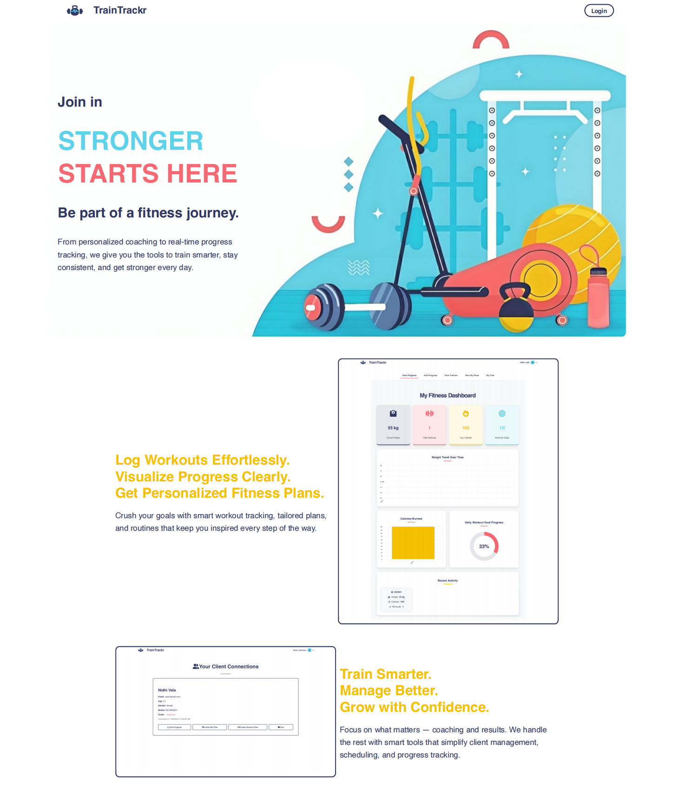
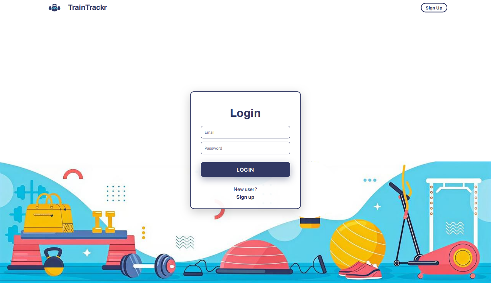
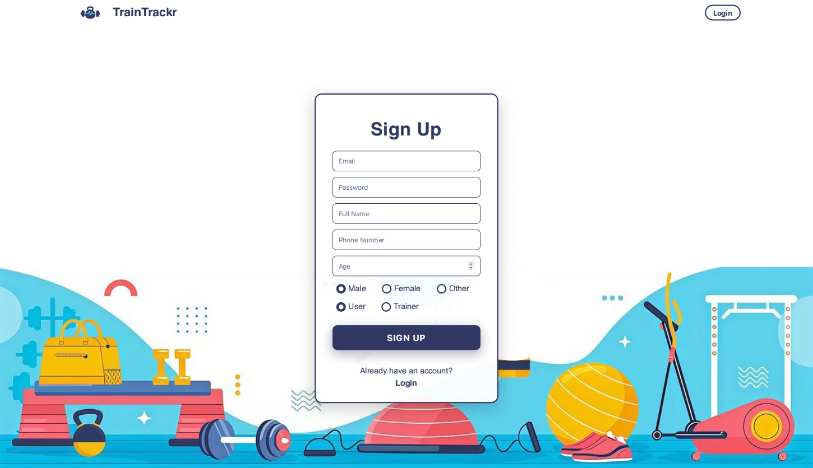
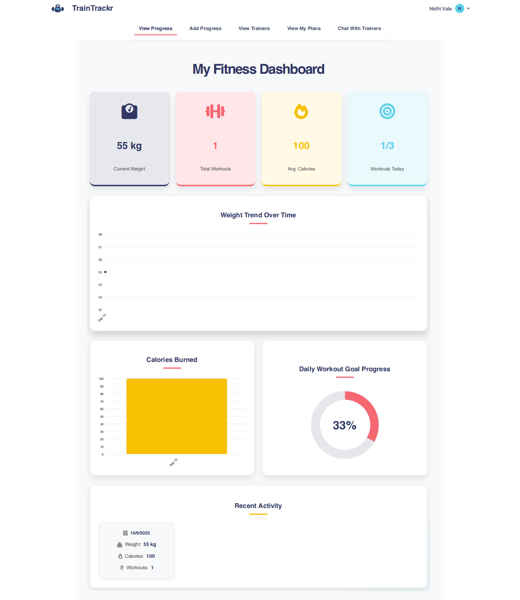
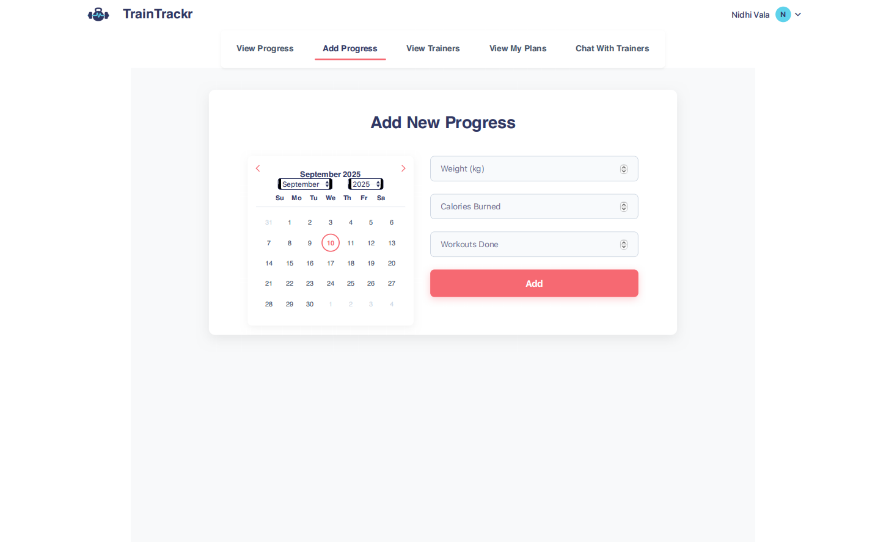
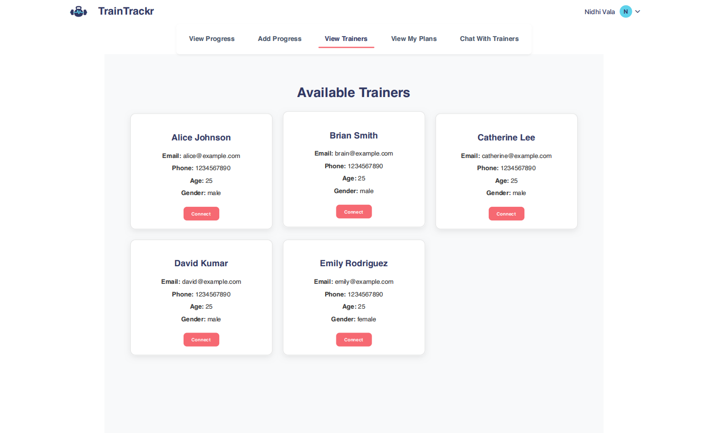
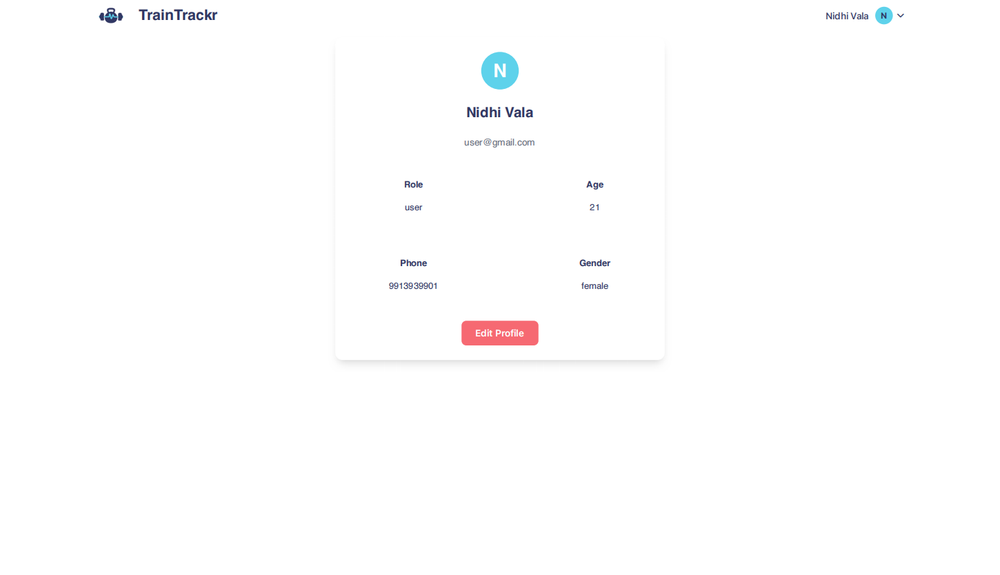
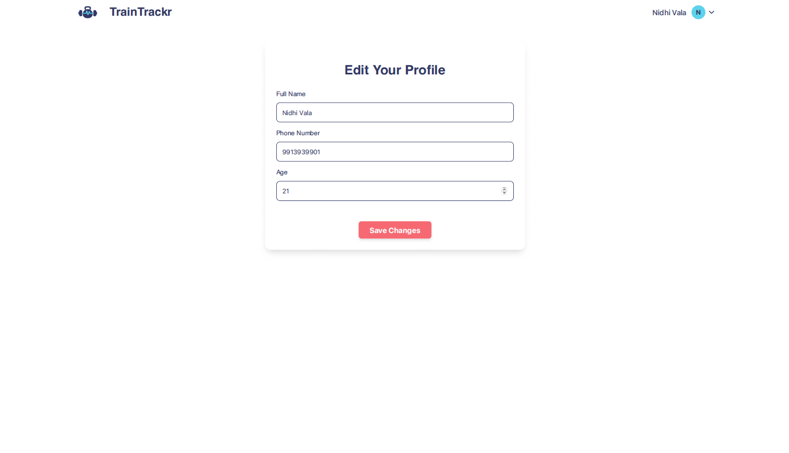
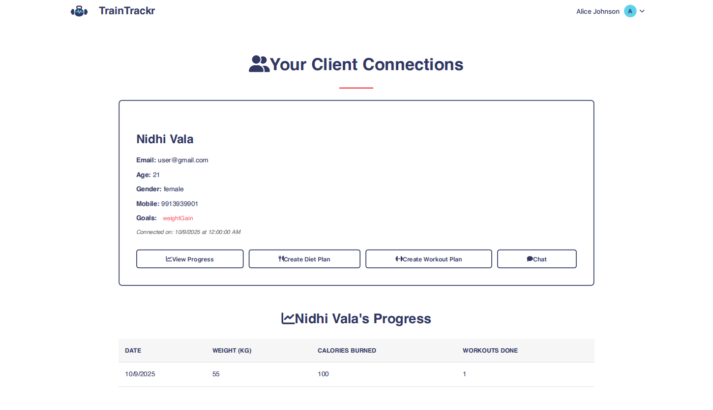

# 🏋️‍♀️ Online Fitness Coaching and Progress Tracking Platform

The **Online Fitness Coaching and Progress Tracking Platform** is a comprehensive web-based solution that connects fitness enthusiasts with certified trainers and delivers personalized, goal-oriented programs. It enables users to create detailed profiles, set health objectives, follow tailored workout and nutrition plans, and track progress through intuitive dashboards and analytics. Trainers can manage multiple clients, monitor progress via logged workouts and health metrics, and provide real-time guidance through integrated chat and media sharing tools.

With role-specific dashboards, advanced analytics, and a responsive design accessible across devices, the platform ensures seamless interaction, improved accountability, and consistent progress. It is scalable for gyms, freelance coaches, and wellness startups, offering a unified, flexible, and results-driven digital fitness experience.

---

## 🚀 Key Features
- 🔑 **Secure Authentication** (role-based access for **Users** & **Trainers**)  
- 📊 **Interactive Dashboards** for Users and Trainers  
- 📝 **Workout & Nutrition Logging**  
- 📈 **Health Metrics Tracking** (weight, BMI, body measurements)  
- 💬 **Chat & Media Sharing** between users and trainers  
- 🎯 **Trainer Dashboard** for client monitoring and management  
- 🧾 **Profile Management** (view/edit profile)  
- 🗂️ **Your Plans & Progress Tracking**  

---

## 🛠️ Tech Stack
- **Frontend**: React.js, Tailwind CSS  
- **Backend**: Node.js, Express.js  
- **Database**: MySQL  
- **Authentication**: JWT  
- **Version Control**: Git & GitHub  

---

## 📸 Screenshots
*(Screenshots are saved in `public/assets/screenshots/` folder)*  

### 🏠 Home Page


### 🔐 Login Page


### ✍️ Sign Up Page


### 📊 User Dashboard


### ➕ Add Progress


### 👀 View Trainers


### 📋 Your Plans


### 💬 Chat with Trainers


### 👤 View Profile


### 👤 Edit Profile


### 🎯 Trainer Dashboard


---

## ⚙️ Installation & Setup

### 1️⃣ Clone the Repository
```bash
git clone https://github.com/NidhiValaa-oss/Fitness-Platform.git
cd Fitness-Platform

2️⃣ Install Backend Dependencies
```bash
cd backend
npm install

Create a .env file inside backend/:


